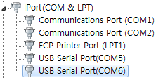
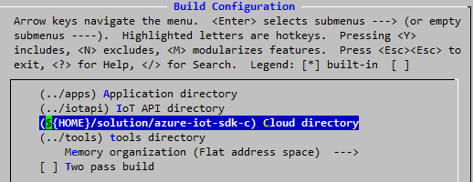
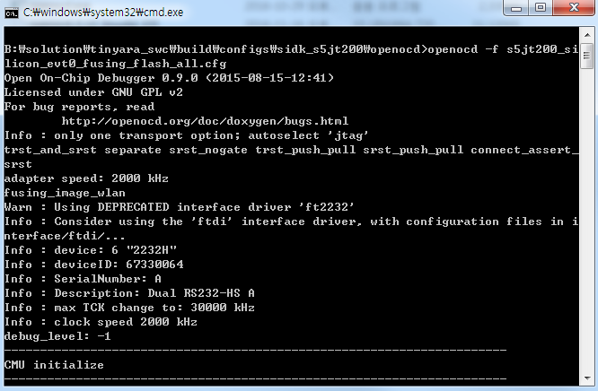
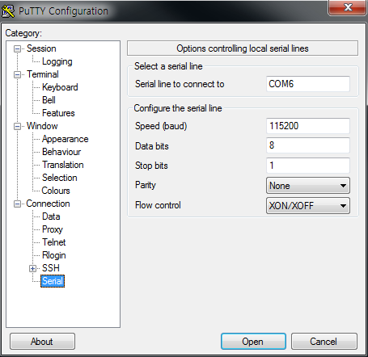

Run a simple C sample on s5tj200 device running Tizen RT
---

# Table of Contents

-   [Introduction](#Introduction)
-   [Step 1: Prerequisites](#Step-1-Prerequisites)
-   [Step 2: Prepare your Device](#Step-2-PrepareDevice)
-   [Step 3: Build and Run the Sample](#Step-3-Build)

<a name="Introduction"></a>
# Introduction

**About this document**

This document describes the steps for connecting an [Tizen RT-enabled s5jt200](http://www.samsung.com/semiconductor/minisite/Exynos/w/) device to Azure IoT Hub. This multi-step process includes:
-   Configuring Azure IoT Hub
-   Registering your IoT device
-   Build and deploy Azure IoT SDK on device

<a name="Step-1-Prerequisites"></a>
# Step 1: Prerequisites

You should have the following items ready before beginning the process:

- Prepare [azure-iot-sdk-c](https://github.com/Azure/azure-iot-sdk-c) to MS Azure IoT services
- [Setup your IoT hub](https://github.com/Azure/azure-iot-sdks/blob/master/doc/setup_iothub.md)
- [Provision your device and get its credentials](https://github.com/Azure/azure-iot-sdks/blob/master/doc/manage_iot_hub.md)

<a name="Step-2-PrepareDevice"></a>
# Step 2: Prepare your Device

s5jt200 is a IoT device with Wi-Fi connectivity. s5jt200 can communicate Azure IoThub with Wi-Fi connection.

-   Prepare [SIDK_S5JT200](http://meritech.co.kr/eng/products/ap_dp.php) HW platform  with s5jt200
-   Prepare [Software and development environment](https://git.tizen.org/cgit/rtos/tinyara/)

After unboxing your HW platform, Please do the followings:

- Install the [ARM compile toolchain](https://launchpad.net/gcc-arm-embedded/4.9/4.9-2015-q3-update) and add your environment about cross compiler path likes
```ruby
export CROSSDEV=/toolchain/gcc-arm-none-eabi-4_9-2015q3/bin/arm-none-eabi-
```

- Get source cdoe in your machine.
```ruby
git clone git://git.tizen.org/rtos/tinyara
```

- Config and compile for SIDK_S5JT200.
```ruby
cd tinyara/os/tools
./configure.sh sidk_s5jt200/sidk_tash
cd ..
make
```

- Install OpenOCD and FTDI chip drivers.
When you first connect sidk board using USB , there isn’t correct driver.You need to install FT2232 IC driver following below instruction.
    - Copy openocd directory (build\configs\sidk_s5jt200\openocd) to your windows PC.
    - Install FTDI chip drivers for your environment.
    - If you properly install the driver, then you can see USB Serial Port on windows device manager.

    .

<a name="Step-3-Build"></a>
# Step3: Build and Fusing the samples

## Build Tizen RT with azure-iot-sdk-c

- Download the azure-iot-sdk-c.
```ruby
git clone --recursive https://github.com/Azure/azure-iot-sdk-c.git
cd azure-iot-sdk-c
git submodule init
git submodule update
```
- Open iothub_client/samples/iothub_client_sample_http/iothub_client_sample_http.c on azure-iot-sdk-c and replace "[device connection string]" with the device connection string that you obtained in Step 1.

- Configure Tizen RT to support Azure cloud with 'make menuconfig'.
```ruby
cd tinyara/os
make menuconfig
```

  - Set your azure-iot-sdk-c path.
    - Go to 'Build Configuration' and set your azure-iot-sdk-c path on 'cloud directory'.

      

  - Enable azure-iot-sdk-c.
    - Go to 'Application Configuration' and select 'cloud'.
    - If you want to run Azure samples like iothub_client_sample_http and simplesample_http, select 'Azure cloud samples'.

      

  - Enable built-in cloud application.
    - Go to 'Application Configuration' and 'Examples' and select 'cloud test'.
    - If you want to run Azure samples with sensor devices on HW platform, select 'cloud test with sensor'. And then write the device connection string that you obtained in Step 1 on 'azure device connection string'

      

- Execute 'make' after configuration. Then you can see libazure.a on os/libraries directory.

## Fusing OS image

- Plug the USB cable on board.
You can check two USB serial ports. First port is for USB download and second port is for serial.
- Execute flash.bat on openocd directory. It erases flash memory and writes new image.

 

## Run samples
- Execute console application likes putty. Configure it with 115200 baud rate and then run it with serial session.

 

- Reset board and write 'cloud azure-iothub-client' on console application to run azure sample.

 
